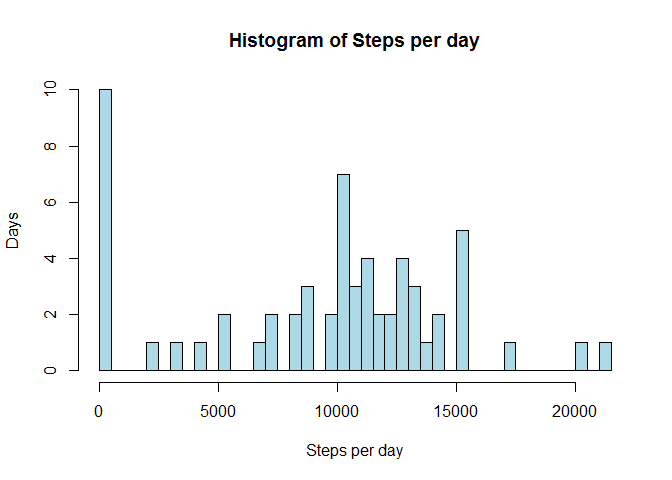
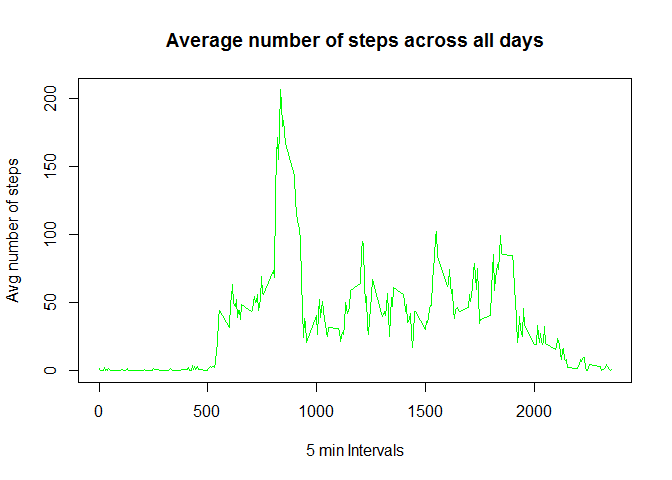
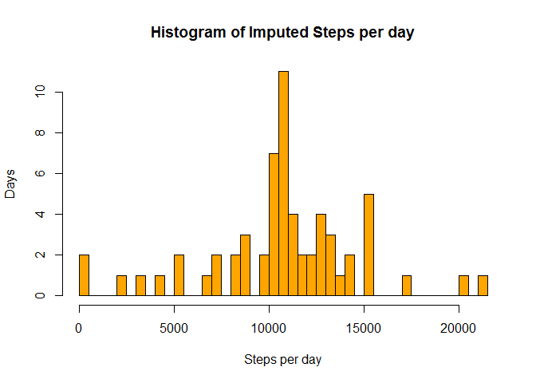
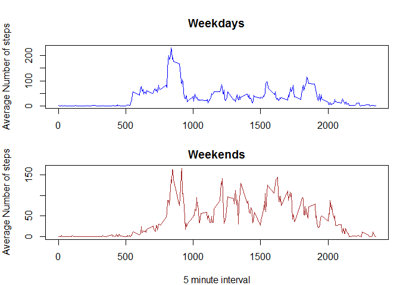

# Reproducible Research: Peer Assessment 1


## Loading and preprocessing the data


```r
monitorData <- read.csv('activity.csv')
```


## What is mean total number of steps taken per day?

Ignoring the missing values in the dataset.


```r
stepsPerDay<-(tapply(monitorData$steps,INDEX=monitorData$date, sum, na.rm=TRUE))
numDays<-length(unique(monitorData$date))
hist(stepsPerDay,xlab = 'Steps per day', ylab='Days', main='Histogram of Steps per day', breaks=numDays, col='lightblue')
```

\


### Mean number of steps per day


```r
mean(stepsPerDay)
```

```
## [1] 9354.23
```

### Median number of steps per day


```r
median(stepsPerDay)
```

```
## [1] 10395
```


## What is the average daily activity pattern?

### Time series plot of the average number of steps taken

```r
avgStepsIn5Min<-tapply(X = monitorData$steps, INDEX = as.factor(monitorData$interval), mean, na.rm=TRUE)
plot(x = unique(monitorData$interval), y=avgStepsIn5Min, type='l', col='green', xlab = '5 min Intervals', ylab = 'Avg number of steps', main = 'Average number of steps across all days')
```

\


### The 5-minute interval that, on average, contains the maximum number of steps

```r
avgStepsIn5Min[avgStepsIn5Min == max(avgStepsIn5Min)]
```

```
##      835 
## 206.1698
```


## Imputing missing values

### Total number of missing values in the dataset

```r
nrow(monitorData[is.na(monitorData$steps),])
```

```
## [1] 2304
```


### Impute NA values with mean for that 5-min interval

```r
imputedData <- monitorData
naRows <- is.na(imputedData$steps)
imputedData[naRows,]$steps <- avgStepsIn5Min[as.character(imputedData[naRows,]$interval)]
```

Using imputed values in the dataset.


```r
imputedStepsPerDay<-(tapply(imputedData$steps,INDEX=imputedData$date, sum))
hist(imputedStepsPerDay,xlab = 'Steps per day', ylab='Days', main='Histogram of Imputed Steps per day', breaks=numDays, col='orange')
```

\


### Mean number of imputed steps per day

```r
mean(imputedStepsPerDay)
```

```
## [1] 10766.19
```


### Median number of imputed steps per day

```r
median(imputedStepsPerDay)
```

```
## [1] 10766.19
```

* The mean and median values of the imputed data are equal and both greater than the non-imputed values.  
* The median of the imputed data is an imputed value since the number of steps in real life can't be a decimal. 
* The impact of the imputed data changes the histogram also.  The number of days with 0 steps dropped significantly from 10 to 2.  The max number of days also changed from 10 to 11 on the y-axis and from 0 steps to around 11000 on the x-axis.


## Are there differences in activity patterns between weekdays and weekends?

### New dayType factor column

```r
imputedData$dayType<-as.factor(ifelse(weekdays(as.POSIXlt(imputedData$date)) %in% c('Saturday','Sunday'), 'weekend', 'weekday'))
```


### Average number of steps during Weekdays and Weekends

```r
imputedWeekdayAvgStepsIn5Min<-tapply(X = imputedData[imputedData$dayType=='weekday',]$steps, INDEX = as.factor(imputedData[imputedData$dayType=='weekday',]$interval), mean)
imputedWeekendAvgStepsIn5Min<-tapply(X = imputedData[imputedData$dayType=='weekend',]$steps, INDEX = as.factor(imputedData[imputedData$dayType=='weekend',]$interval), mean)

par(mfrow=c(2,1))
par(mar=c(3,4,4,1))
plot(y=imputedWeekdayAvgStepsIn5Min, x = unique(imputedData$interval), type = 'l', main = 'Weekdays', ylab='Average Number of steps', col='blue')
par(mar=c(4,4,2,1))
plot(y=imputedWeekendAvgStepsIn5Min, x = unique(imputedData$interval), type = 'l', main = 'Weekends', xlab='5 minute interval', ylab='Average Number of steps', col='brown')
```

\
